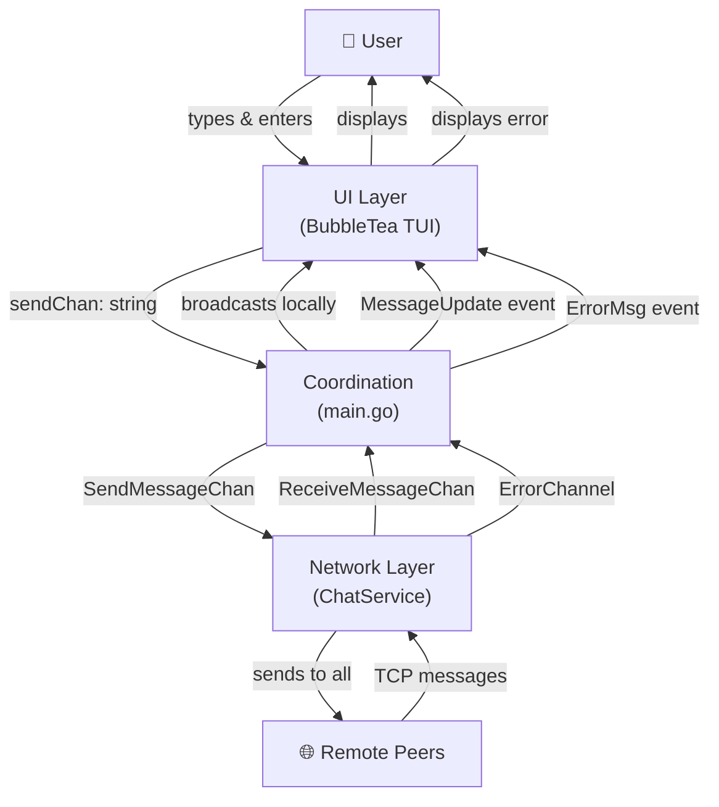
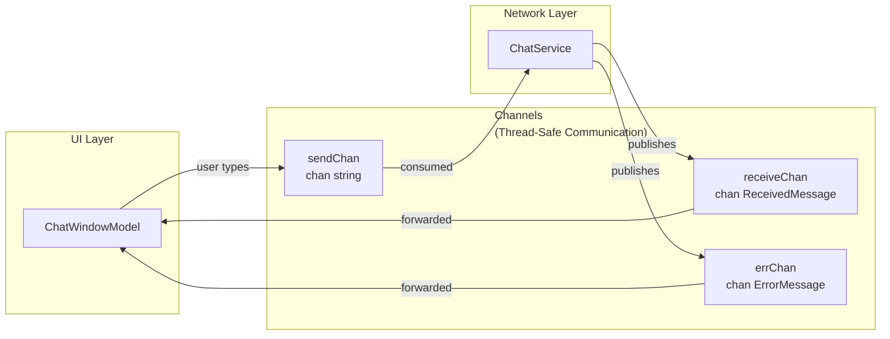
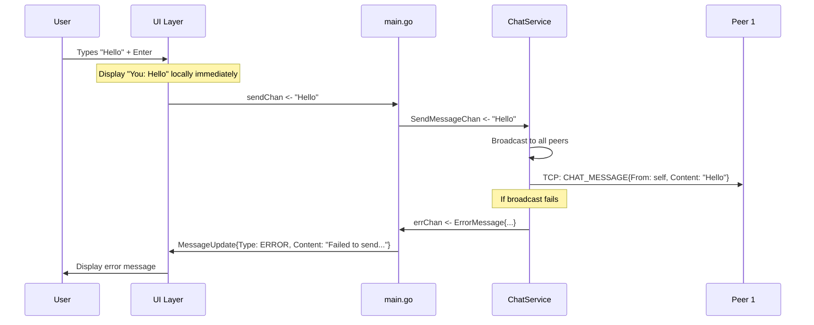
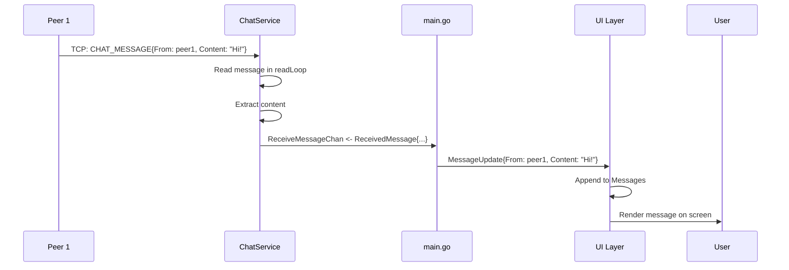

# Basic Decoupled Messaging Implementation Plan

## Overview

This plan describes how to implement **simple peer-to-peer message sending** where the UI and networking layers are completely decoupled. Users can type and send messages that reach all connected peers, with error feedback for failed sends.

**Scope**: Basic unencrypted messaging only. No SWIM, heartbeats, or failure detection yet.

**Key principles**:
- The UI does not know about networking
- The network layer does not know about the UI
- `main()` wires them together via channels
- User messages are displayed locally immediately; the network service never sees them
- Network errors are reported back to the UI via an error channel

---

## Current State

- ✅ Discovery works (multicast + TCP connections)
- ✅ Hello message handshake in place
- ✅ Read loop exists to receive messages
- ❌ UI cannot trigger message sends
- ❌ Received messages don't reach the UI
- ❌ No separation of concerns (networking + UI are tightly coupled)
- ❌ No error reporting from network layer to UI

---

## Architecture

### High-Level Data Flow



### Channel-Based Decoupling



### Message Flow: Sending



### Message Flow: Receiving



---

## Three Independent Layers

```
┌──────────────────────────────────────┐
│           UI Layer                   │
│     • Captures user input            │
│     • Displays messages              │
│     • No networking logic            │
│     • Sends/receives via channels    │
└──────────────────┬───────────────────┘
                   │
        ┌──────────┴──────────┐
        │                     │
   sendChan            receiveChan, errChan
        │                     │
        └──────────┬──────────┘
                   │
┌──────────────────▼───────────────────┐
│      Coordination (main.go)          │
│     • Wires layers together          │
│     • Forwards messages between      │
│     • Closes channels on exit        │
└──────────────────┬───────────────────┘
                   │
        ┌──────────┴──────────┐
        │                     │
   SendMessageChan   ReceiveMessageChan, ErrorChannel
        │                     │
        └──────────┬──────────┘
                   │
┌──────────────────▼───────────────────┐
│        Network Layer                 │
│     • Manages connections            │
│     • Sends messages to peers        │
│     • Receives from peers            │
│     • Reports errors                 │
└──────────────────────────────────────┘
```

---

## Implementation Steps

### Step 1: Define Error and Message Types

**File**: `chat/service.go` (add to top-level types)

Add these types for structured messaging:

```go
type ReceivedMessage struct {
    From      string
    Content   string
    Timestamp time.Time
}

type ErrorMessage struct {
    Message   string
    Timestamp time.Time
}
```

**Why**: Allows UI to distinguish between regular messages, errors, and other event types without using string parsing.

---

### Step 2: Update ChatService with Channels

**File**: `chat/service.go` (modify `ChatService` struct)

Add channel fields for send/receive and error handling:

```go
type ChatService struct {
    LocalPeerID string
    connections map[string]net.Conn
    listener    net.Listener
    peers       map[string]Peer
    mu          sync.RWMutex
    
    // Channels for decoupled messaging
    SendMessageChan      chan string              // UI sends here
    ReceiveMessageChan   chan<- ReceivedMessage   // Received messages sent here
    ErrorChannel         chan<- ErrorMessage      // Errors sent here
}
```

**Why**: 
- `SendMessageChan`: Network reads what the UI wants to send
- `ReceiveMessageChan`: Network publishes received messages (UI subscribes)
- `ErrorChannel`: Network publishes errors (UI subscribes)
- All are buffered to prevent blocking

---

### Step 3: Add Send Loop to ChatService

**File**: `chat/service.go` (add methods to `ChatService`)

```go
func (c *ChatService) Start(listener net.Listener) {
    c.mu.Lock()
    c.listener = listener
    c.mu.Unlock()
    
    go c.acceptLoop()
    go c.sendMessageLoop()  // NEW
}

func (c *ChatService) sendMessageLoop() {
    for content := range c.SendMessageChan {
        err := c.Broadcast(content)
        if err != nil && c.ErrorChannel != nil {
            c.ErrorChannel <- ErrorMessage{
                Message:   fmt.Sprintf("Failed to broadcast: %v", err),
                Timestamp: time.Now(),
            }
        }
    }
}
```

**Why**:
- Decouples send requests from actual broadcast
- Handles errors gracefully
- Non-blocking channel read won't freeze the service

---

### Step 4: Update Receive Loop to Publish Messages

**File**: `chat/service.go` (modify `readLoop()`)

In the existing `readLoop()` method, when a `CHAT_MESSAGE` is received:

```go
func (c *ChatService) readLoop(peerID string, conn net.Conn) {
    defer conn.Close()
    defer func() {
        c.mu.Lock()
        if existingConn, ok := c.connections[peerID]; ok && existingConn == conn {
            delete(c.connections, peerID)
        }
        c.mu.Unlock()
    }()

    for {
        message, err := c.readMessage(conn)
        if err != nil {
            return
        }
        
        // NEW: Forward chat messages to the UI layer
        if message.Type == CHAT_MESSAGE {
            if c.ReceiveMessageChan != nil {
                c.ReceiveMessageChan <- ReceivedMessage{
                    From:      message.From,
                    Content:   string(message.Content),
                    Timestamp: message.Timestamp,
                }
            }
            slog.Info(
                "received message",
                "from", message.From,
                "content", string(message.Content),
            )
        }
    }
}
```

**Why**:
- Separates receive from display logic
- Network layer publishes; UI subscribes
- No circular dependencies

---

### Step 5: Update UI to Send Messages via Channel

**File**: `ui/window.go` (modify `ChatWindowModel`)

Add the send channel field and update the constructor:

```go
type ChatWindowModel struct {
    Users      map[string]User
    Messages   []ChatMessage
    textinput  textinput.Model
    sendChan   chan<- string  // NEW
}

func NewChatWindowModel(sendChan chan<- string) ChatWindowModel {
    input := textinput.New()
    input.Placeholder = "Type a message..."
    input.Focus()
    return ChatWindowModel{
        Users:     make(map[string]User),
        Messages:  make([]ChatMessage, 0),
        textinput: input,
        sendChan:  sendChan,  // NEW
    }
}
```

Update the "enter" key handler:

```go
case "enter":
    input := strings.TrimSpace(c.textinput.Value())
    if input != "" {
        // Display locally immediately (user feedback)
        c.Messages = append(c.Messages, ChatMessage{
            Type:    USER_MESSAGE,
            From:    "You",
            Content: input,
        })
        
        // Send to network layer (non-blocking)
        select {
        case c.sendChan <- input:
            // Sent to network layer
        default:
            // Channel full, add local error display
            c.Messages = append(c.Messages, ChatMessage{
                Type:    SYSTEM_MESSAGE,
                Content: "⚠️ Send buffer full, message may not reach peers",
            })
        }
        
        c.textinput.SetValue("")
    }
    return c, nil
```

**Why**:
- User sees their message immediately (local display)
- Network layer handles actual sending
- UI doesn't wait for network confirmation
- Graceful handling of channel full (rare but possible)

---

### Step 6: Add Error Message Handling to UI

**File**: `ui/messages.go` and `ui/window.go`

The existing `SYSTEM_MESSAGE` type already covers errors. No changes needed here—errors will be sent as `MessageUpdate{Type: SYSTEM_MESSAGE, ...}`.

**Why**:
- Reuses existing UI infrastructure
- Errors appear as system messages (distinct from peer messages)
- No new UI types needed for MVP

---

### Step 7: Wire Everything in main()

**File**: `cmd/lanchat/main.go` (modify `main()` function)

Replace the current service setup and add channel wiring:

```go
func main() {
    // SETUP UI
    sendChan := make(chan string, 10)  // Buffer 10 messages
    model := ui.NewChatWindowModel(sendChan)
    p := tea.NewProgram(model)

    // SETUP LOGGING
    logOutput := io.MultiWriter(os.Stderr, model)
    logger := slog.New(slog.NewTextHandler(logOutput, &slog.HandlerOptions{Level: slog.LevelDebug}))
    slog.SetDefault(logger)

    // SETUP MULTICAST DISCOVERY NETWORKING
    peers := make(map[string]string)
    multicast := chat.NewMultiCastDiscovery()
    defer multicast.Close()
    discoveredPeerChan, errChan, tcpListener, err := multicast.Listen()
    defer tcpListener.Close()
    if err != nil {
        panic(err)
    }

    // SETUP UNICAST CHAT SERVICE with channels
    receiveChan := make(chan chat.ReceivedMessage, 10)  // Buffer 10 messages
    errorChan := make(chan chat.ErrorMessage, 10)       // Buffer 10 errors
    
    chatService := chat.NewChatService(multicast.PeerID)
    chatService.SendMessageChan = sendChan
    chatService.ReceiveMessageChan = receiveChan
    chatService.ErrorChannel = errorChan
    chatService.Start(tcpListener)
    defer chatService.Close()

    // GOROUTINE: Forward received messages to UI
    go func() {
        for msg := range receiveChan {
            p.Send(ui.MessageUpdate{
                Type:    ui.USER_MESSAGE,
                From:    msg.From,
                Content: msg.Content,
            })
        }
    }()

    // GOROUTINE: Forward errors to UI
    go func() {
        for err := range errorChan {
            p.Send(ui.MessageUpdate{
                Type:    ui.SYSTEM_MESSAGE,
                Content: fmt.Sprintf("⚠️ %s", err.Message),
            })
        }
    }()

    // GOROUTINE: Handle peer discovery (existing code, unchanged)
    go func() {
        for discoveredPeerChan != nil || errChan != nil {
            select {
            case peer, ok := <-discoveredPeerChan:
                if !ok {
                    discoveredPeerChan = nil
                    continue
                }
                if _, ok := peers[peer.PeerID]; !ok {
                    peers[peer.PeerID] = peer.Addr
                    chatService.RegisterPeer(peer)
                    p.Send(ui.NewUserMsg{Peer: peer})
                }
            case err, ok := <-errChan:
                if !ok {
                    errChan = nil
                    continue
                }
                panic(err)
            }
        }
    }()

    // RUN UI
    if _, err := p.Run(); err != nil {
        panic(err)
    }
}
```

**Why**:
- `sendChan` passes user input to network
- `receiveChan` publishes peer messages to UI
- `errorChan` publishes network errors to UI
- Three independent goroutines forward data
- `main()` is the only place aware of all layers

---

## Full Implementation Checklist

### chat/service.go
- [ ] Add `ReceivedMessage` type
- [ ] Add `ErrorMessage` type
- [ ] Add channel fields to `ChatService` struct:
  - [ ] `SendMessageChan chan string`
  - [ ] `ReceiveMessageChan chan<- ReceivedMessage`
  - [ ] `ErrorChannel chan<- ErrorMessage`
- [ ] Implement `sendMessageLoop()` method
- [ ] Update `Start()` to launch `sendMessageLoop()`
- [ ] Update `readLoop()` to publish received chat messages to `ReceiveMessageChan`
- [ ] Update `Broadcast()` or create wrapper to report errors to `ErrorChannel`

### ui/window.go
- [ ] Add `sendChan chan<- string` field to `ChatWindowModel`
- [ ] Update `NewChatWindowModel()` to accept `sendChan` parameter
- [ ] Update "enter" key handler in `Update()` to:
  - [ ] Display message locally first
  - [ ] Send to `sendChan` (non-blocking with select)
  - [ ] Handle channel-full gracefully with system message

### cmd/lanchat/main.go
- [ ] Create `sendChan` with buffer size 10
- [ ] Create `receiveChan` with buffer size 10
- [ ] Create `errorChan` with buffer size 10
- [ ] Pass all three channels to `ChatService`
- [ ] Pass `sendChan` to `NewChatWindowModel()`
- [ ] Launch goroutine to forward `receiveChan` to UI
- [ ] Launch goroutine to forward `errorChan` to UI

### Testing
- [ ] Two peers connect via discovery
- [ ] Send message from Peer A → verify appears on Peer B
- [ ] Send message from Peer B → verify appears on Peer A
- [ ] Send message when no peers connected → verify error on UI
- [ ] Send rapid messages → verify no deadlock

---

## Design Decisions

| Decision | Rationale | Trade-off |
|----------|-----------|-----------|
| **Buffered channels (size 10)** | Prevents blocking; UI stays responsive | Extra memory; may drop messages if buffer full |
| **User messages displayed locally** | Immediate user feedback; low latency | Doesn't wait for network confirmation; could have duplicate if logic changes |
| **Network errors sent to UI** | User sees failures; can take action | Extra complexity; need error handling in UI |
| **Non-blocking send to channel** | Service never blocks on UI | May lose message if buffer full (rare with size 10) |
| **CHAT_MESSAGE never looped back** | Prevents duplicate display; simpler logic | User messages not echoed from network (acceptable for LAN) |

---

## Future Extensions (Out of Scope)

These can be added later without changing the channel architecture:

- **Encryption**: Wrap payload in `Broadcast()` before sending; unwrap in `readLoop()`
- **Delivery confirmation**: Add `ack` message type to confirm receipt
- **Typing indicators**: New message type for "person X is typing"
- **Message history**: Persist to disk periodically
- **Heartbeats**: Separate goroutine sends PING periodically (Section 8 of architecture doc)
- **Liveness detection**: Track last-seen per peer, timeout inactive (SWIM pattern)
- **Group re-keying**: Epoch management on peer join/leave (Section 9 of architecture doc)

---

## Data Flow Summary

```
User Input
    ↓
UI captures + displays locally
    ↓
sendChan <- "message"
    ↓
ChatService.sendMessageLoop() consumes
    ↓
Broadcast to all connected peers
    ↓
    ├─→ Success: silent (no feedback loop)
    └─→ Error: errorChan <- ErrorMessage
                ↓
                main() forwards
                ↓
                UI displays error

Peer sends message
    ↓
ChatService.readLoop() receives TCP
    ↓
ReceiveMessageChan <- ReceivedMessage
    ↓
main() forwards
    ↓
UI appends to messages
    ↓
User sees peer message on screen
```

---

## Potential Issues & Mitigations

| Issue | Cause | Mitigation |
|-------|-------|-----------|
| Send blocks if no peer connections | Broadcast succeeds even with 0 peers | Not an error; liveness detection will be added later |
| Error channel fills up | Too many errors too fast | Increase buffer size; add error aggregation |
| Messages reordered | Multiple peers, out-of-order TCP | Out of scope; TCP per-connection ordering guaranteed |
| User message sent twice | Bug in send logic | Unit test the channel flow; code review |
| Channel closed panic | Service shuts down mid-send | Ensure channels closed after loops exit |
| UI becomes unresponsive | Receive/error channel full | Use buffered channels; increase buffer size if needed |

---

## Success Criteria

- ✅ User types "Hello" and presses Enter
- ✅ "You: Hello" appears immediately on sender's screen
- ✅ "Hello" is broadcast to all connected peers
- ✅ On receiving peers, "[PeerName]: Hello" appears on their screen
- ✅ If broadcast fails (no peers), error message appears on sender's screen
- ✅ No deadlocks or blocking on UI
- ✅ Layers are completely independent (UI doesn't know about networking)
- ✅ Multiple rapid sends work without issues

---

## Architecture Principles Applied

1. **Separation of Concerns**: UI, networking, and coordination are independent
2. **Channel-Based Communication**: Thread-safe without explicit locking
3. **Non-Blocking Sends**: UI never waits for network
4. **Local Feedback**: User sees their message immediately
5. **Error Reporting**: Failures communicated back to UI
6. **Extensibility**: Can add encryption, persistence, liveness without changing UI

---

## Implementation Time Estimate

- Chat service modifications: **30 minutes**
- UI modifications: **15 minutes**
- Main wiring: **15 minutes**
- Testing: **30 minutes**
- **Total**: ~90 minutes for a developer familiar with the codebase

---

## Key Files to Modify

```
chat/service.go       ← Add types, channels, and loops
ui/window.go          ← Add sendChan field, update key handler
cmd/lanchat/main.go   ← Wire everything together
```

No new files needed for Phase 1.

---

## Notes

- This plan keeps the implementation **minimal** while establishing **clean architecture**
- All changes are **backward compatible** with existing discovery/connection logic
- The channel pattern is **extensible**: can add heartbeat, liveness, encryption later
- **main()** becomes the "wiring diagram" for all system components
- Tests should focus on **channel flow**, not implementation details
